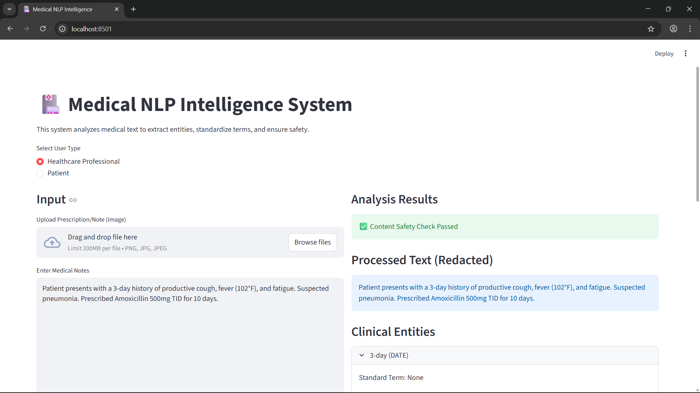
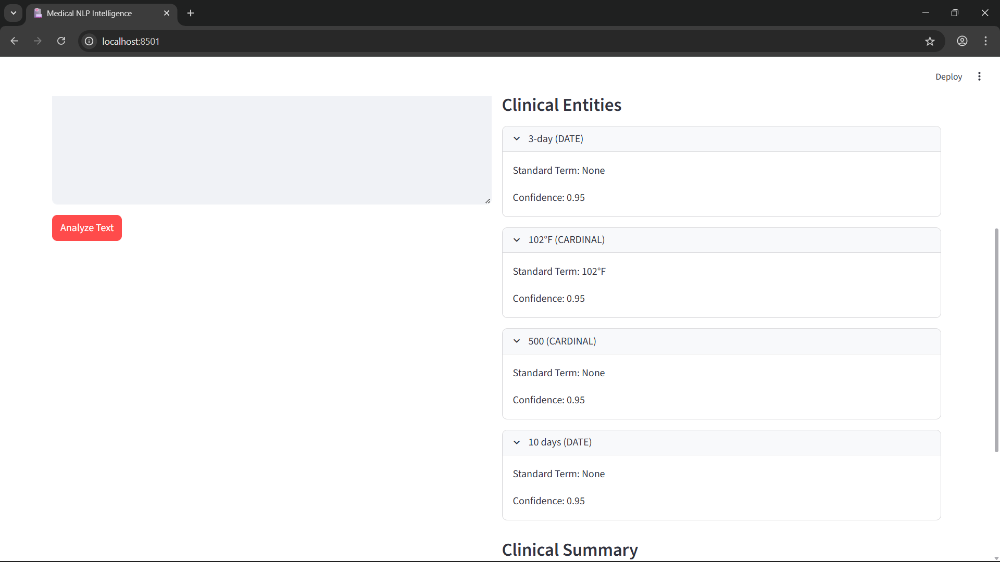
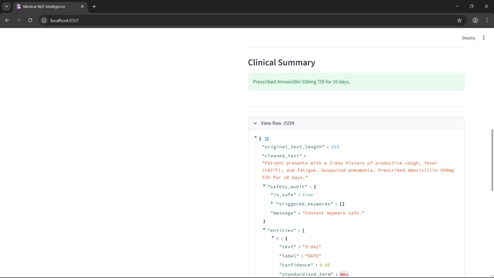

# Medical NLP Intelligence System

An AI-powered web application for analyzing clinical text using Natural Language Processing.

The system extracts medical entities, applies safety guardrails for PII redaction, and generates both clinician-focused and patient-friendly summaries using transformer-based language models.

---

## Features

• Medical entity extraction using NLP  
• PII detection and redaction (SSN, sensitive data)  
• Clinical summary generation for healthcare professionals  
• Patient-friendly explanations  
• OCR support for extracting text from medical documents  
• Interactive UI for analysis  

---

## Application Preview

### Streamlit Interface


### Entity Extraction


### Patient Summary


## Tech Stack

**Backend**
- FastAPI
- Python
- HuggingFace Transformers

**NLP**
- SpaCy
- Medical glossary normalization
- Transformer summarization models

**Frontend**
- Streamlit

**Other**
- EasyOCR
- Pandas / NumPy

---

## Installation

```bash
git clone https://github.com/YOUR_USERNAME/medical-nlp-intelligence.git
cd medical-nlp-intelligence
pip install -r requirements.txt

## **Install Dependencies**
pip install -r requirements.txt

## **Run backend API**
uvicorn src.api.main:app --reload

## **Run the streamlit frontend**
streamlit run app.py
